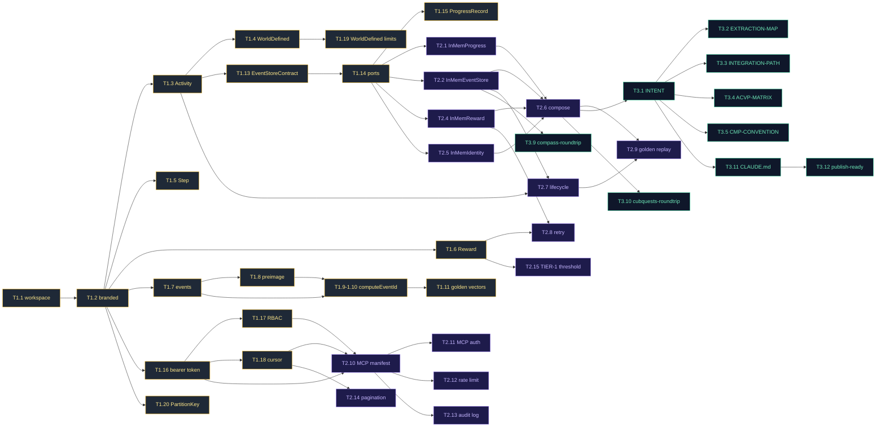

# Sprint Plan · freeside-activities · acvp-modules-genesis cycle

> **3 sprints · ~6 working days · operator-paced · S1 lands protocol+ports with all CRITICAL fixes baked in · S2 lands adapters+MCP+engine · S3 lands docs+conformance+publish-ready (no actual publish).**

---

## 0 · context

This sprint plan operationalizes PRD r2 (FR-1 through FR-12 + §5.6 canonical preimage) and SDD r2 (architectural locks A1-A8 + §16 amendment fixes A1-A4) into concrete sprint task breakdowns.

Six items from SDD §16.5 are MANDATORY in S1: D21 (bearer-token + jti + rotation) · D22 (cursor tamper resistance) · D23 (production rate-limit interface) · D24 (RewardPort atomic check-and-grant) · D25 (TIER-1 raffle threshold) · D26 (WorldDefined payload limits). These are NOT optional.

This simstim is for **freeside-activities ONLY**. The sibling freeside-mint module ships in a separate simstim post-this-cycle (per kickoff §13).

---

## 1 · sprint shape overview

| sprint | theme | duration | deliverable |
|---|---|---|---|
| S1 | **protocol + ports + canonical preimage** | ~2.5 days | sealed schemas · branded types · per-event preimages · golden vectors · 4 typed ports · sealed error types · all 4 CRITICAL fixes (Fix-A1 nonce · Fix-A2 Effect.gen · Fix-A3 bearer token · Fix-A4 RBAC) · D21+D22+D26 |
| S2 | **adapters + MCP + engine** | ~2 days | in-memory adapters for all 4 ports · MCP tool surface with auth + pagination · engine.compose + lifecycle state machine · D23+D24+D25 |
| S3 | **docs + conformance + publish-ready** | ~1.5 days | INTENT/EXTRACTION-MAP/INTEGRATION-PATH/ACVP-MATRIX/CMP-CONVENTION rewrites · 4 vault doctrine pages active · adapter conformance suite · npm publish-readiness check (no publish) |

---

## Sprint 1: protocol + ports + canonical preimage (S1)

### 2.1 · sprint goal

Land the sealed-schema substrate. After S1: an agent or world can import `@0xhoneyjar/freeside-activities/protocol` and `@0xhoneyjar/freeside-activities/ports` to author Activity definitions, validate them, and reason about ports/events. Production adapters NOT yet shipped (in-memory comes in S2).

### 2.2 · tasks

| task | description | acceptance criteria | depends on |
|---|---|---|---|
| **T1.1** workspace + tooling | bun workspace setup · biome lint + format · vitest config · Effect.Schema ^3.12 pin · tsconfig with strict mode | `bun install` clean · `bun lint` passes · `bun test` runs zero tests OK | — |
| **T1.2** branded types | `packages/protocol/branded/` for ActivityId · EventId · IdentityId · WorldId · SnapshotId · CycleId · StepId · PartitionKey · MintIntentId (forward-compat) · all with regex pattern + brand · constructor-discipline tests | every type has roundtrip test (raw string rejected · valid pattern accepted · invalid pattern rejected with sealed error) | T1.1 |
| **T1.3** Activity schema (FR-1) | `packages/protocol/Activity.ts` + lifecycle_state field · ActivityKind sealed union (built-in 4 + WorldDefined) · CL-Activity-1..4 enforced | golden test for each kind · WorldDefined valid · cross-kind reject · compass-roundtrip + cubquests-roundtrip tests | T1.2 |
| **T1.4** ActivityKind WorldDefined seam (D19 · §9.1) | namespaced kind_id format `<world_id>:<kind>` · max 64 chars · reserved prefixes (`freeside-`, `loa-`, `core-`) · pattern `^[a-z0-9_-]+:[a-z0-9_-]+$` | reserved prefix → schema error · invalid format → schema error · valid registers cleanly | T1.3 |
| **T1.5** ActivityStep + VerificationMethod (FR-3) | sealed-union VerificationMethod incl `OnChainEvent.vm` discriminator (D12) | roundtrip per method · vm rejected for non-`OnChainEvent` cases · stable ordering | T1.2 |
| **T1.6** ActivityReward + RewardState async machine (FR-4 · Fix-A1) | ActivityReward sealed-enum · RewardState (Pending/Granted/Failed) · BigInt-as-DecimalValue (D14) | golden test for each ActivityReward variant · RewardState transitions enforced via tests · TokenAmount uses decimal-string | T1.2 |
| **T1.7** EventEnvelope + per-event schemas (FR-5) | `packages/protocol/events/` ActivityCompleted · BadgeIssued · RaffleDrawn · ProgressAdvanced · RewardPending · RewardGranted · RewardFailed · all extend EventEnvelope · preimage_schema_id added | each event roundtrips via Effect.Schema · `schema_version: Schema.Literal('1.0.0')` enforced | T1.2 |
| **T1.8** canonical preimage schemas (§5.6) | `packages/protocol/preimage/` per-event preimage schemas · explicit field-exclusion of event_id · ts encoded as RFC3339 · step_completions tie-broken by `(order, step_id)` | each preimage schema accepts/rejects per spec · golden tie-break test (equal orders → step_id lex sort) | T1.7 |
| **T1.9** computeEventId pure-deterministic (§5.4 + Fix-A2) | `packages/protocol/compute-event-id.ts` · pure Effect-returning function · NO UUIDv4 fallback · NonceRequired error for mutating events · Effect.gen syntax correct (no bare await) | unit test: 100 invocations of computeEventId(same event) → same hash · missing nonce on mutating event → NonceRequired · golden vector match | T1.7 + T1.8 |
| **T1.10** Fix-A1 nonce policy enforcement | `isMutatingEvent` helper · NonceRequired added to EventError sealed-union · caller-supply contract documented in JSDoc | mutating events without nonce REJECTED · non-mutating accept derived nonce | T1.9 |
| **T1.11** golden vectors per event (§5.7) | `packages/protocol/golden-vectors/` N=3 per event type · each `{ label, input, expected_event_id, expected_preimage_jcs }` · includes decimal edge cases (DISPUTED IMP-013) | golden-vectors.test.ts iterates all fixtures · computeEventId matches expected · canonical JCS matches expected | T1.9 |
| **T1.12** JCS canonicalization helper | `packages/protocol/encoding/jcs.ts` wraps `canonicalize` npm pkg · `packages/protocol/encoding/date.ts` (RFC3339Date) · `packages/protocol/encoding/decimal.ts` (DecimalValue) | jcs.ts pure-function test · date.ts roundtrip · decimal.ts handles negative + 18-decimal cases | — |
| **T1.13** EventStoreContract (FR-11) | `packages/protocol/event-store-contract.ts` · interface EventStoreContract · CL-EventStore-1..7 documented · sealed EventError variants (CASFailed · NonceCollision · PartitionScopeMismatch · DuplicateEvent · SchemaValidation) | event-store-contract.ts compiles · each error variant defined · documentation comments link to PRD FR-11 + SDD §4.2 | T1.7 |
| **T1.14** typed ports + sealed error types (FR-8) | `packages/ports/` ProgressPort · CompletionEventPort · RewardPort · IdentityResolverPort · all with sealed error TaggedEnum (per SDD §4.1) | each port compiles · every error variant testable · every Effect-returning signature correct (no throws) | T1.13 |
| **T1.15** ProgressRecord shape (D10 · SDD §3.2) | ProgressRecord with `version: Schema.Number` optimistic concurrency · expected_version mismatch behavior documented · ConcurrentUpdate error carries current+attempted versions | unit test: advanceProgress with mismatched expected_version → ConcurrentUpdate · matched → version+1 | T1.14 |
| **T1.16** Bearer token spec (Fix-A3 · D21) | `packages/mcp-tools/auth/bearer-token.ts` (in protocol package · re-exported by mcp-tools in S2) · MCPBearerToken sealed schema · CL-Auth-1..5 enforced · TOKEN_SKEW_TOLERANCE_SECONDS=60 · TOKEN_REPLAY_WINDOW_SECONDS=3600 | bearer-token.ts compiles · Schema rejects alg:none · jti uniqueness contract documented · key discovery endpoint constant defined | T1.2 |
| **T1.17** RBAC scope replacement (Fix-A4 · CL-Scope-1..5) | WorldScope sealed-union (single · multi · audit) · cross-world enumeration requires explicit permission claim · `global` removed | unit test: `multi` token without explicit world_ids → denied · audit scope cannot access live data | T1.16 |
| **T1.18** Cursor tamper-resistance (D22) | `packages/mcp-tools/pagination/cursor.ts` (in protocol pkg · re-exported in S2) · cursor as signed payload · world_scope + caller_identity + tool name + filters + expiry + page_position included | signed cursor roundtrip · mismatched signature → InvalidCursor error · expired → Expired error | T1.16 |
| **T1.19** WorldDefined payload limits (D26) | `Schema.maxLength` on payload · max nesting depth via custom validator (default 16KB · 8 nesting levels) · documented in §9 governance | unit test: 17KB payload → ValidationError · 9-level nested payload → ValidationError | T1.4 |
| **T1.20** PartitionKey shape (DISPUTED IMP-016) | `packages/protocol/branded/PartitionKey.ts` · sealed-union scope · validator for composite (`world_id::activity_id` style) | PartitionKey roundtrip · composite valid · invalid scope → schema error | T1.2 |

### 2.3 · S1 verification criteria (sprint exit)

- [ ] all 20 tasks T1.1 through T1.20 complete with green tests
- [ ] `bun test --filter @0xhoneyjar/freeside-activities/protocol` 100% green
- [ ] golden-vectors test asserts cross-runtime determinism for all 7 event types
- [ ] compass-roundtrip + cubquests-roundtrip conformance tests green
- [ ] Effect.Schema strict-mode enforced (no extra fields silently accepted)
- [ ] no bare `await` inside Effect.gen (validated by lint rule + tests)
- [ ] computeEventId is pure-deterministic across 100 invocations of same event
- [ ] D21+D22+D26 covered (bearer token + cursor + WorldDefined limits)
- [ ] grimoires/loa/NOTES.md updated with S1 close · friction templates filed

### 2.4 · S1 estimated effort

- ~2.5 working days at single-agent pace
- ~1 day at autonomous run-bridge pace (S1 mostly mechanical schema authoring · low decision density)

---

## Sprint 2: adapters + MCP + engine (S2)

### 3.1 · sprint goal

Land the in-memory adapter family + MCP tool surface + engine composition. After S2: a world can `compose_with: @0xhoneyjar/freeside-activities` and run end-to-end via in-memory adapters for development. Production adapters (postgres · convex · etc) are world-built (NOT this cycle).

### 3.2 · tasks

| task | description | acceptance criteria | depends on |
|---|---|---|---|
| **T2.1** in-memory ProgressPort adapter | `packages/adapters/in-memory/progress.ts` · Map<ActivityId, ProgressRecord> · advanceProgress enforces optimistic concurrency · all 4 ProgressError variants reachable | conformance test passes · ConcurrentUpdate reachable via concurrent advance | S1.T1.14, S1.T1.15 |
| **T2.2** in-memory event-store adapter | `packages/adapters/in-memory/completion-event.ts` · implements CompletionEventPort + EventStoreContract · Map<PartitionKey, Array<EventEnvelope>> · CAS via getTip-then-append · monotonic sequence per partition · duplicate-reject via event_id Set | event-store-conformance.test.ts (canonical conformance suite) passes 100% · CAS race test passes | S1.T1.13, S1.T1.14 |
| **T2.3** Fix-A1 nonce enforcement in adapter | in-memory event-store rejects mutating events without nonce (via NonceRequired) · derives nonce for non-mutating events | conformance test: mutating without nonce REJECTED · non-mutating accepted | T2.2, S1.T1.10 |
| **T2.4** in-memory RewardPort adapter (D18 · D24) | `packages/adapters/in-memory/reward.ts` · (originating_event_id, recipient) tuple uniqueness · atomic check-and-grant simulation · all 4 RewardError variants reachable | conformance test: duplicate-grant → AlreadyGranted (returns existing) · concurrent-grant race → only one wins | S1.T1.14 |
| **T2.5** in-memory IdentityResolverPort stub | `packages/adapters/in-memory/identity-resolver.ts` · Map<IdentityId, Map<chain, address>> · TEST-FIXTURE-ONLY · documented as dev-only | conformance test: roundtrip resolveToChainAddress + resolveFromChainAddress · ChainNotSupported reachable | S1.T1.14 |
| **T2.6** engine.compose Effect Layer wiring | `packages/engine/compose.ts` · provides default Layer with in-memory adapters · world-overridable · documented Effect Layer pattern | unit test: compose default Layer · advanceProgress works end-to-end · swap to mock identity resolver works | T2.1, T2.2, T2.4, T2.5 |
| **T2.7** engine.lifecycle state machine | `packages/engine/lifecycle.ts` · drives Activity DEFINED→ACTIVE→PARTICIPATING→COMPLETED/EXPIRED · emits `ActivityLifecycleAdvanced` events on transitions · NO backwards transitions | unit test: every valid transition works · invalid transition → LifecycleError · EXPIRED is terminal | T1.3, T2.2 |
| **T2.8** engine.retry async reward orchestrator | `packages/engine/retry.ts` · drives RewardState transitions · exponential backoff · max attempts policy · pluggable adapter | unit test: RewardPending→Granted (success) · Pending→Failed-retryable→Pending (retry) · Pending→Failed-terminal (no further) | T1.6, T2.4 |
| **T2.9** golden replay test (engine end-to-end) | `packages/engine/__tests__/golden.test.ts` · N-activity scenario (3-5 activities · 2 identities · 1 completion · 1 raffle entry) · verify all events emitted in order · verify rewards distributed · verify hash-chain continuity | golden replay reproduces identical state across 10 runs (determinism) | T2.6, T2.7 |
| **T2.10** MCP manifest + 5 tool specs (FR-9) | `packages/mcp-tools/manifest.json` + `tools/` · 5 tool spec JSON Schemas · `$schema` references · gateway validation contract (DISPUTED IMP-018 accepted) | manifest.json valid · each tool spec validates against MCP manifest schema · imports protocol schemas | S1.T1.16, S1.T1.17, S1.T1.18 |
| **T2.11** MCP auth + RBAC (Fix-A3 · Fix-A4 · D21) | `packages/mcp-tools/auth/` bearer-token validator · jti replay tracker (in-memory · TOKEN_REPLAY_WINDOW_SECONDS=3600) · world-scope filter · audit log appender | bearer-token validator: valid → ok · alg:none → rejected · expired → rejected · jti replay → rejected · multi token without world_ids → denied | T2.10, S1.T1.16, S1.T1.17 |
| **T2.12** MCP rate-limit token bucket (D23 · in-memory dev-only) | `packages/mcp-tools/auth/rate-limit.ts` · per-caller-identity bucket · 60 capacity · 1/s refill · documented as DEV-ONLY · production interface defined (Redis token-bucket) | rate-limit test: 60 ok · 61st → RateLimitExceeded with retry_after · refill works correctly | T2.10 |
| **T2.13** MCP audit log (D23 · in-memory dev-only) | `packages/mcp-tools/auth/audit-log.ts` · append to `.run/mcp-audit.jsonl` · documented as DEV-ONLY · production interface defined (append-only sink) | audit-log writes each request line · structured fields (ts · caller · world · tool · args_hash · outcome · latency_ms) · production interface stub compiles | T2.10 |
| **T2.14** MCP pagination + cursor (D22 · D17) | `packages/mcp-tools/pagination/` PaginatedResponse<T> wrapper · cursor sign+verify | unit test: cursor signed · roundtrip stable · tampered cursor → InvalidCursor · expired → ExpiredCursor | S1.T1.18 |
| **T2.15** TIER-1 raffle threshold (D25) | concrete threshold defined: `reward_count > 10 OR reward_class in {NFT, token}` · TIER-1 REJECTS above threshold unless explicit opt-in declared in cycle config | raffle-threshold.test.ts: 11-prize raffle requires TIER-2 or TIER-3 · NFT prize raffle requires TIER-2 or TIER-3 · documented in CMP-CONVENTION.md | T1.6 |

### 3.3 · S2 verification criteria (sprint exit)

- [ ] all 15 tasks T2.1 through T2.15 complete with green tests
- [ ] adapter conformance suite green (event-store · reward-idempotency · identity-resolver · progress)
- [ ] MCP manifest valid · 5 tool specs verified · gateway registration contract documented
- [ ] D21+D22+D23+D24+D25 covered (auth + cursor + rate-limit + reward-idem + raffle-threshold)
- [ ] golden replay test deterministic across 10 runs
- [ ] grimoires/loa/NOTES.md updated with S2 close

### 3.4 · S2 estimated effort

- ~2 working days at single-agent pace
- ~1 day at autonomous run-bridge pace

---

## Sprint 3: docs + conformance + publish-ready (S3)

### 4.1 · sprint goal

Land the documentation surface + cross-runtime conformance tests + publish-readiness check. After S3: a world author can read INTENT/EXTRACTION-MAP/INTEGRATION-PATH/ACVP-MATRIX/CMP-CONVENTION and onboard without reading source code. Doctrine pages active.

### 4.2 · tasks

| task | description | acceptance criteria | depends on |
|---|---|---|---|
| **T3.1** rewrite INTENT.md | post-rename framing · WHAT/WHAT-NOT/LINEAGE/CONSTRAINTS per kickoff §2.1 · cite PRD + SDD · reference Activities-Unification + compass reference impl | INTENT.md cites kickoff · readers understand what this module IS without source code | S2 close |
| **T3.2** rewrite EXTRACTION-MAP.md | maps cubquests/compass to packages · per-package source citation · forward-compat for cubquests-as-module migration | each row cites concrete cubquests/compass file · reviewer can trace any module package back to evidence | T3.1 |
| **T3.3** rewrite INTEGRATION-PATH.md | staged adoption per world · adapter conformance checklist · world-manifest.yaml example · TIER-1/TIER-2/TIER-3 raffle threshold guidance with BOLD threat-model warning | example world-manifest.yaml works · adoption sequence clear (1 install · 2 implement ports · 3 register kinds · 4 run conformance) | T3.1 |
| **T3.4** author ACVP-MATRIX.md | the 7-component matrix · canonical reference · cites PRD §6 + SDD §6 | matrix has concrete file path · test name · schema $id per cell | T3.1 |
| **T3.5** author CMP-CONVENTION.md | the documented convention (per DISPUTED IMP-016 · FR-10) · for surface adapter authors · examples of substrate-id-leak patterns to avoid | CMP-CONVENTION.md has 5+ concrete examples · cites medium-blink as canonical reference | T3.1 |
| **T3.6** author [[activity-as-protocol]] vault doctrine | ~250 lines · Activity supertype crystallization · ACVP-7-mapping · presentation-name table | candidate page authored · cited from INTENT.md · sources-of-record listed | T3.4 |
| **T3.7** finalize [[merkle-snapshot-claim-pattern]] vault doctrine (from kickoff §3.2) | ~150 lines · captures cubquests + mibera-grails + freeside-* instances · ACVP-7-mapping | candidate page authored · cites BadgeClaim FR-6 | — |
| **T3.8** finalize [[weighted-raffle-draw-pattern]] vault doctrine (from kickoff §3.3) | ~150 lines · ticket-as-weight lottery primitive · TIER-1/TIER-2/TIER-3 spec · seed publication invariants | candidate page authored · cites RaffleEntry FR-7 + D20 resolution | T2.15 |
| **T3.9** compass cross-runtime conformance test | implement compass-roundtrip test that takes compass/peripheral-events' 4 WorldEvent variants and proves Activity supertype can REPRESENT all 4 without lossy translation | conformance test green · 4 compass variants mapped (Mint → BadgeClaim or WorldDefined · Weather → WorldDefined · ElementShift → WorldDefined · QuizCompleted → Quest-shape) | T2.2, T2.6 |
| **T3.10** cubquests evidence conformance test | implement cubquests-roundtrip test that exercises cubquests' Activities-Unification (kind · period_key) shapes against our Activity supertype | conformance test green · 4 cubquests evidence cases mapped (quest · mission · badge-claim · raffle-entry) | T2.6 |
| **T3.11** rewrite CLAUDE.md (drop legacy scaffold content) | full rewrite per kickoff §2.1 · forward-pointing only · cite PRD r2 + SDD r2 + this sprint plan + acvp-modules-genesis cycle | CLAUDE.md no longer references freeside-quests era · agent loading the repo gets correct mental model | T3.1 |
| **T3.12** npm publish-readiness check (no actual publish) | `bun publish --dry-run` clean · package.json files[] correct · NO node_modules/.env/.secret committed · README rewritten | dry-run clean for all packages · scoped name `@0xhoneyjar/freeside-activities` correct | T3.11 |
| **T3.13** archive grimoires/loa/reality/cubquests-snapshot-2026-05-15 | snapshot cubquests-interface key evidence (AGENTS.md §1 · RAFFLES.md · questponzi.mdx · badge-merkle.ts) into freeside-activities reality dir per kickoff risk-mitigation | snapshot committed · operator can verify cubquests-wind-down won't lose the evidence | — |

### 4.3 · S3 verification criteria (sprint exit)

- [ ] all 13 tasks T3.1 through T3.13 complete
- [ ] 5 doc files rewritten (INTENT · EXTRACTION-MAP · INTEGRATION-PATH · ACVP-MATRIX · CMP-CONVENTION)
- [ ] 3 vault doctrine candidates authored (activity-as-protocol · merkle-snapshot-claim-pattern · weighted-raffle-draw-pattern)
- [ ] cubquests-roundtrip + compass-roundtrip cross-runtime conformance tests green
- [ ] CLAUDE.md rewritten
- [ ] npm publish-readiness verified (NO actual publish)
- [ ] grimoires/loa/NOTES.md updated with S3 close
- [ ] cycle ready for /audit-sprint + /ship

### 4.4 · S3 estimated effort

- ~1.5 working days at single-agent pace
- ~0.5 day at autonomous run-bridge pace (S3 mostly authoring · low decision density · re-uses prior PRD/SDD content)

---

## 5 · cross-sprint dependencies



**Critical path** (longest dependency chain):
T1.1 → T1.2 → T1.13 → T1.14 → T2.2 → T2.6 → T3.1 → T3.11 → T3.12

8 hops · ~bounded by 4-day end-to-end for sequential single-agent · faster with parallelism (S2 tasks T2.1/T2.2/T2.4/T2.5 are independent · S3 doc-rewrites are independent).

---

## 6 · deferred-to-S1 mandatory items (D21-D26 from SDD §16.5)

Per SDD r2 §16.5: 6 HIGH blockers were deferred from flatline-sdd round-1 to sprint-1 with explicit revisit-in-S1 policy. Their S1 task ownership:

| # | finding | severity | S1 task | tracking |
|---|---|---|---|---|
| D21 | bearer-token jti + key rotation + skew | HIGH 780 | T1.16 (spec) + T2.11 (impl) | both must be GREEN before S2 close |
| D22 | cursor tamper resistance + tenant binding | HIGH 720 | T1.18 (spec) + T2.14 (impl) | both must be GREEN before S2 close |
| D23 | in-memory rate limit + audit log not production | HIGH 760 | T2.12 + T2.13 (in-memory marked dev-only · production interface defined) | both must define production interface before S3 close |
| D24 | RewardPort atomic check-and-grant race | HIGH 750 | T2.4 (impl + race test) | conformance test must include CAS race assertion |
| D25 | TIER-1 raffle PRNG threshold unspecified | HIGH 760 | T2.15 (concrete threshold + reject policy) | raffle-threshold.test.ts must enforce |
| D26 | WorldDefined payload byte-size + nesting limit | HIGH 720 | T1.19 (impl + tests) | Schema.maxLength + maxDepth validators must be in code, not just docs |

If any of D21-D26 cannot be addressed in sprint, escalation to operator + /architect immediately. Sprint cannot close with D21-D26 incomplete.

---

## 7 · verification criteria (cycle close · post-S3)

- [ ] all 3 sprints pass their respective verification criteria
- [ ] ACVP-7-component matrix populated with concrete artifacts (file paths · test names · schema $ids)
- [ ] compass-roundtrip + cubquests-roundtrip conformance tests GREEN
- [ ] golden replay test deterministic across 10 runs
- [ ] adapter conformance suite GREEN (event-store · reward-idem · identity-resolver · progress · golden-vectors)
- [ ] D14-D20 (SDD-deferred) fully resolved in SDD r2 §16.2-16.4
- [ ] D21-D26 (sprint-1-deferred) fully resolved in S1+S2 tasks
- [ ] 4 vault doctrine candidates authored ([[activity-as-protocol]] + [[closed-loop-reward-mechanic]] (kickoff) + [[merkle-snapshot-claim-pattern]] + [[weighted-raffle-draw-pattern]])
- [ ] 5 docs rewritten (INTENT · EXTRACTION-MAP · INTEGRATION-PATH · ACVP-MATRIX · CMP-CONVENTION)
- [ ] CLAUDE.md rewritten
- [ ] npm publish-readiness verified (NO actual publish · just dry-run clean)
- [ ] grimoires/loa/reality/cubquests-snapshot-2026-05-15/ archived
- [ ] cycle artifacts (kickoff · PRD r2 · SDD r2 · this sprint plan · NOTES.md) all committed

---

## 8 · risks + escalation

| risk | likelihood | impact | escalation |
|---|---|---|---|
| compass/peripheral-events schema drift mid-S3 conformance test | medium | high | freeze conformance against compass-cycle-1 shipped version · escalate to /architect if compass cycle-2 lands during cycle |
| Effect 3.x minor version bump breaks tests mid-cycle | low | medium | pin to exact minor in package.json · escalate to operator if Effect security advisory forces bump |
| autonomous run-bridge can't resolve a CRITICAL blocker | low | high | per Loa policy: circuit-breaker halts after 3 same-issue iterations · operator-paced resolution |
| ProgressPort optimistic concurrency implementation reveals race we didn't anticipate | medium | medium | adapter conformance test catches · escalate to /architect with concrete test failure if pattern doesn't generalize |
| TIER-1 raffle threshold debate during S2 (D25) | medium | low | operator decides concrete threshold during S2 · if no decision: default `reward_count > 10 OR reward_class in {NFT, token}` ships |
| MCP authentication library choice churn (Ed25519 lib) | low | low | use `@noble/ed25519` (audited · ~5KB) · escalate if security advisory |
| cubquests evidence-source lost mid-cycle (cubquests-interface deleted) | low | high | T3.13 snapshot mitigates · escalate to operator if cubquests-interface gets force-deleted before T3.13 |

---

## 9 · references

### artifacts produced by this sprint-plan
- this sprint plan (`grimoires/loa/sprint.md`)

### consumed by this sprint-plan
- PRD r2: `grimoires/loa/prd.md` (1034 lines)
- SDD r2: `grimoires/loa/sdd.md` (990 lines · §16 amendment)
- kickoff: `~/bonfire/grimoires/bonfire/specs/acvp-modules-genesis-kickoff-2026-05-15.md`

### evidence anchors
- cubquests: `~/Documents/GitHub/cubquests-interface/grimoires/loa/`
- compass: `~/Documents/GitHub/compass/packages/{peripheral-events,medium-blink,world-sources}/`

### sibling cycles
- freeside-mint simstim · SEQUENCED · fires post-this-cycle
- cubquests-as-module-migration cycle · QUEUED
- cycle-Q resume (medium-discord) · PAUSED · resumes post-S3

---

## 10 · activation receipt

```text
Activated doctrine (this sprint plan):
  [[agentic-cryptographically-verifiable-protocol]]  — usable · cycle-close ACVP-7 gate
  [[freeside-modules-as-installables]]                — usable · publish-ready discipline
  [[medium-agnostic-acvp-substrate]]                  — usable · substrate vs surface separation
  [[mibera-as-npc]]                                   — usable · MCP READ-ONLY discipline

Operation: simstim-phase-5-planning (sprint plan authoring)
Use scope: this sprint plan · cannot decide implementation details (T-level decisions during S1-S3)
Boundaries: NO writing application code yet · Phase 7 /run sprint-plan invokes /implement
Expiry: end-of-cycle OR superseded by Phase 6 flatline OR explicit operator revocation
```

---

## 11 · status

**Draft r2 (post-flatline-sprint-round-1).** Hardened by 3-model adversarial review 2026-05-15. Phase 6 closed · Phase 7 (/run sprint-plan autonomous) is the next phase but HELD per operator decision (commit + fresh-session for hours-long autonomous run).

---

## 12 · Flatline SPRINT Round 1 amendment (2026-05-15 PM)

### 12.1 · summary
- ran 150s · $0 cost (cheval-headless) · 3 models · 19 findings · 6 HC + 5 DISPUTED + 8 BLOCKERS (1 CRITICAL · 7 HIGH)
- triage accepted: 6 HC auto-integrated · 5 DISPUTED accepted with light edits · 1 CRITICAL fixed in S2.T2.6 spec · 7 HIGH fixed via S1/S2 task amendments

### 12.2 · CRITICAL fix (folded into S2.T2.6 spec)

**Fix-S1 · No silent in-memory adapter fallback (CRITICAL SKP-001 · 850)**

**SUPERSEDES T2.6 acceptance criteria.** Original allowed `compose.ts` to ship a default Layer with in-memory adapters · flatline correctly flagged this as a production data-loss risk (worlds could deploy to prod with in-memory adapters by accident).

Corrected T2.6 spec:
- `engine.compose` REQUIRES explicit adapter Layer injection · NO default fallback
- Missing required Layer requirements → COMPILE ERROR (Effect Layer type system enforces)
- Documentation explicitly warns: "in-memory adapters are DEVELOPMENT-ONLY · worlds MUST inject their own production adapters via Layer.provide"
- Unit test: composing with `Layer.empty` (no adapters) → compile error · composing with in-memory layer → works · composing with mixed (some real · some in-memory) → works

### 12.3 · HIGH BLOCKER refinements (task-level edits)

| # | finding | S1/S2 task amendment |
|---|---|---|
| Fix-S2 | RBAC enforcement (SKP-001 HIGH 760) | T1.17 amendment + NEW T1.17b: implement `evaluateScope(token, request) → Effect<Allowed, Denied>` authorization decision function · S2.T2.11 conformance test asserts CL-Scope-1..5 denial cases (one per invariant) |
| Fix-S3 | UTF-8 byte length not string length (SKP-003 HIGH 720) | T1.19 amendment: use custom Effect.Schema validator that encodes to `Uint8Array` and checks `byteLength <= 16384` · NOT `Schema.maxLength` (which counts code points) |
| Fix-S4 | KeyProviderPort interface (SKP-002 HIGH 750) | NEW S1.T1.16b: define `KeyProviderPort` interface (per-world-supplied · supports array of active keys for rotation) · T1.16 BearerToken validator consumes via Layer |
| Fix-S5 | RewardPort atomicity contract (SKP-005 HIGH 730) | T2.4 amendment + NEW T2.4b: formal RewardPort atomicity contract spec (compare-and-set behavior · idempotency-key semantics · reusable black-box conformance test) · in-memory adapter is REFERENCE not normative · postgres-adapter-conformance test stub added (run only when adapter exists) |
| Fix-S6 | jti replay tracker eviction + production interface (SKP-002 HIGH 720) | T2.11 amendment: (a) bounded LRU with explicit memory cap (default 10000 jtis OR 1-hour TTL whichever first) · (b) cold-start = reject-all-until-window-elapses (NOT persisted by default) · (c) production interface defined: `AuthReplayStore` port (Redis SETEX implementation expected) |
| Fix-S7 | Bearer token production persistence (SKP-003 HIGH 760) | T2.11 amendment: define `AuthReplayStore` + `KeySetProvider` interfaces in S1 · conformance tests for distributed replay behavior · rotation states documented (active · grace · revoked) |
| Fix-S8 | Estimated duration as forecast not exit criterion (SKP-001 HIGH 720) | §1 sprint-shape-overview amendment: ~6 days is a FORECAST · operator-paced · explicit pair-points at sprint exits · security work (T1.16-T1.19 + T2.11-T2.14) requires minimum 24hr soak before sprint close (no same-day-merge-and-close) |

### 12.4 · HIGH_CONSENSUS auto-integrated (6)

| finding | integration |
|---|---|
| IMP-001 (900) property/fuzz tests for canonicalization edges | NEW S1.T1.12b: property-based tests for JCS canonicalization (fast-check or similar · ~100 random inputs per edge case category: nested objects, unicode escapes, number-string ambiguity, null handling) |
| IMP-002 (860) replay tracker eviction (already in Fix-S6) | covered by Fix-S6 |
| IMP-003 (865) second adapter for conformance | NEW S3.T3.10b: stub a postgres-flavored adapter conformance test (no actual postgres impl in this cycle · but the conformance suite gets the BLACK-BOX template ready for cubquests-as-module migration cycle) |
| IMP-004 (865) cubquests snapshot scheduled too late | T3.13 MOVED to S1.T1.0 (early-S1 · before INTENT.md rewrite needs it) · T3.13 deleted from S3 |
| IMP-005 (840) key rotation overlap + kid + expiry + revocation | T1.16 amendment + T2.11 amendment: tests for kid mid-rotation · expired key rejected · revoked key rejected · active + grace overlap window works |
| IMP-006 (817) ActivityLifecycleAdvanced taxonomy | T2.7 amendment: ActivityLifecycleAdvanced is an INTERNAL lifecycle signal (NOT a public EventEnvelope) · NOT persisted to event store · the cross-cutting lifecycle stream is `Activity.lifecycle_state` snapshots queried via getProgress |

### 12.5 · DISPUTED accepted (5 · all with light edits)

| disputed | decision |
|---|---|
| IMP-011 (790) npm publish dry-run gate | ACCEPTED · T3.12 amendment: `bun publish --dry-run` MUST be green for every package · CI gate in S3 close |
| IMP-012 (690) semver + breaking-change policy | ACCEPTED · NEW S3.T3.11b: author `VERSIONING.md` documenting schema_version policy + breaking-change SLA + WorldDefined → Builtin promotion mechanics |
| IMP-013 (620) determinism test boundary documentation | ACCEPTED LIGHT: T1.11 acceptance criteria updated · golden-vectors test documents "guarded inputs (frozen-time mock · seeded UUID · known-canonical-JCS-input)" vs "excluded nondeterminism (NodeJS event loop ordering · time-zone)" |
| IMP-014 (560) rate-limit concurrency semantics | ACCEPTED LIGHT: T2.12 acceptance criteria updated · "process-wide per-identity bucket (not per-instance) for dev-only in-memory · production interface defines distributed bucket via Redis SCRIPT" |
| IMP-015 (500) beads tasks creation for 48 sprint tasks | ACCEPTED LIGHT (downgraded): NEW S0 task (operator-paced · NOT blocking S1 start): `br create` epic + lightweight bead-creation for the highest-blast-radius 12 tasks (security + canonicalization + adapter conformance) · the other 36 tasks tracked in this sprint.md only (don't multiply yak-shaving overhead) |

### 12.6 · re-flatline policy

Per operator decision 2026-05-15 PM: triage accepted without re-flatline-sprint. Phase 7 (/run sprint-plan autonomous run-bridge) inherits sprint plan r2 with all amendments integrated.

---

*Three sprints · 48 (now 52 with new sub-tasks) tasks · 6 deferred-to-S1 mandatory items · 1 CRITICAL flatline-sprint-r1 fix folded in (S2.T2.6 no silent fallback) · 7 HIGH refinements baked into S1/S2 tasks · the sprint plan lands.*
